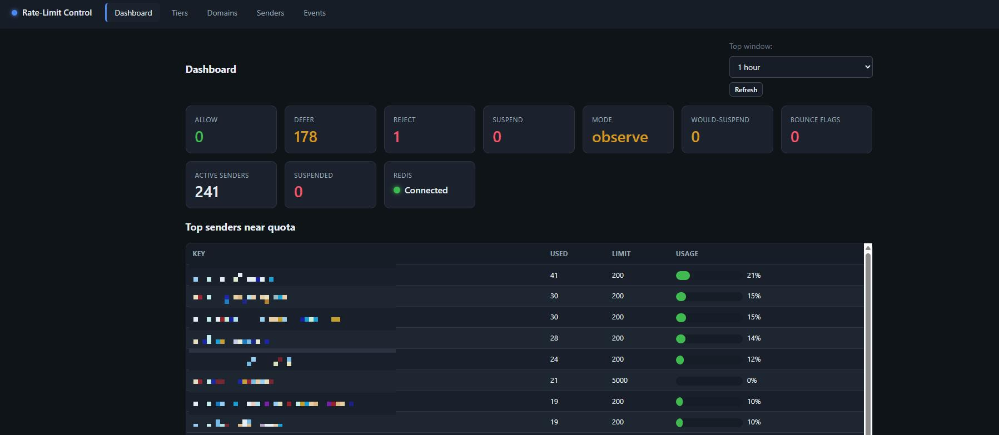
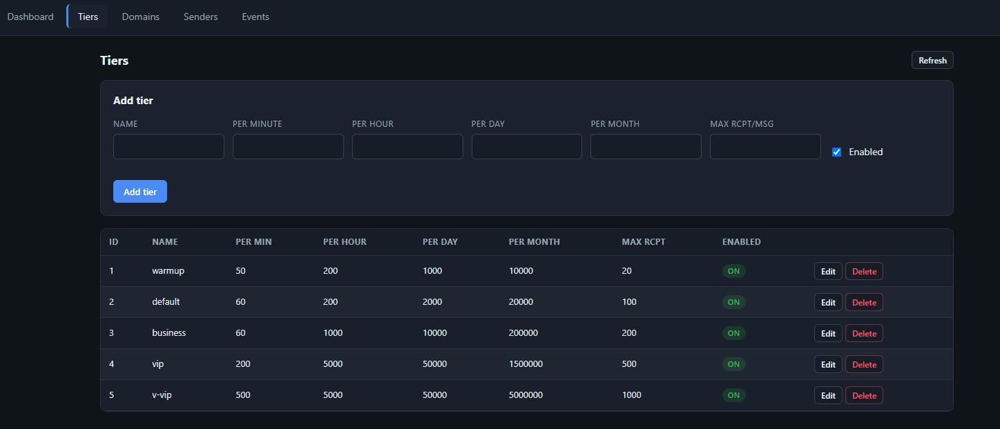
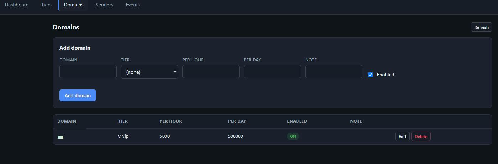
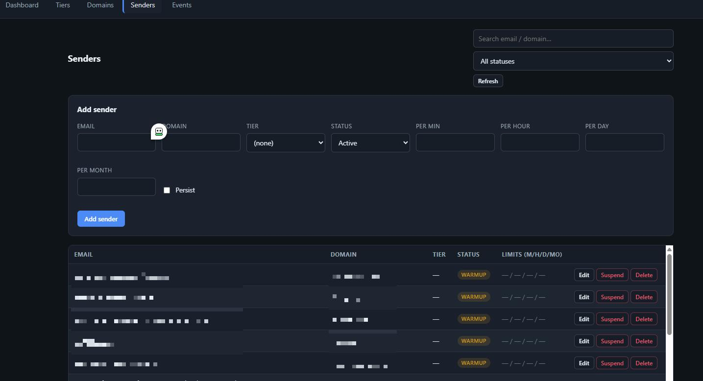
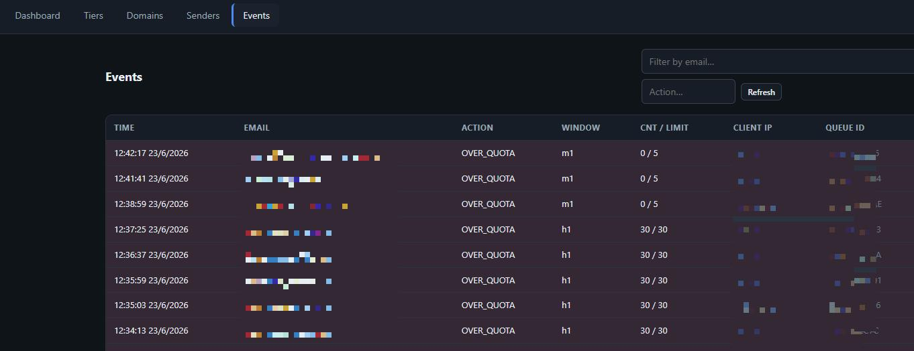
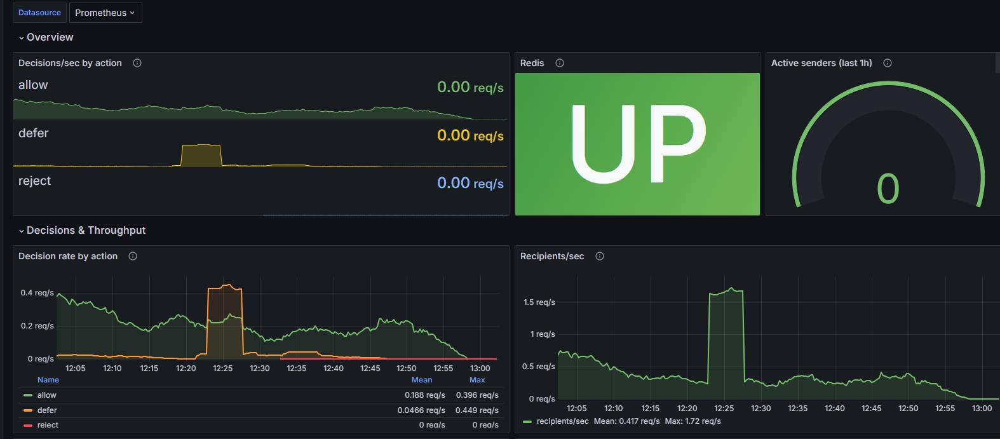

# Outbound Email Rate Limiter & Anti-Spam Policy Service for Postfix

A high-availability **Postfix / SMTP policy-delegation service** that rate-limits **outbound email** per sender, per domain, and per tier — with **anomaly detection**, **bounce-rate reputation gating**, a **web admin UI**, and **Prometheus/Grafana** monitoring. Built with **NestJS + Redis (Sentinel) + MariaDB**, fully **Dockerized** and **horizontally scalable** to millions of senders.


> Stop your mail server from becoming an open relay for compromised accounts. Enforce **how many emails each user/domain can send per minute / hour / day / month**, automatically **suspend** hijacked accounts that spike or bounce, and keep mail flowing with a **fail-open** design — all configurable from a web UI.



---

## Why this exists

Most mail servers (Postfix, Proxmox Mail Gateway …) have weak or no **outbound** rate limiting. A single phished or scripted account can blast thousands of messages, burn your IP reputation, and land you on blocklists. This service plugs into Postfix's **policy delegation protocol** and gives you precise, global, multi-tenant control over outbound sending — the kind large email providers (SES, SendGrid, Mailgun) build internally.

**Use cases:** shared hosting & control panels (cPanel/DirectAdmin/Plesk), email gateways, ESP/bulk senders, multi-tenant SaaS, ISPs — anywhere you must cap and police outbound SMTP.

## Features

- **Postfix policy delegation** over TCP — decisions at the `DATA` stage where the recipient count is known.
- **Multi-window limits** enforced together: per **minute / hour / day / month**.
- **Multi-scope limits**: per **sender** (SASL username) **and** per **domain**, atomically in one Redis call.
- **Tiers** (`warmup` / `default` / `business` / `vip`): most users inherit a tier, so you manage **millions of users without a row each**. Precedence: `sender override > domain override > tier > default`.
- **Account warm-up**: new senders start restricted and graduate automatically after N days — stops freshly-created accounts from blasting.
- **Per-message recipient cap** to block fan-out (one message to thousands of BCC).
- **Behavioural anomaly detection** (velocity spikes, high fan-out, off-hours blasting) with a **0–100 risk score**.
- **Observe vs enforce modes** — roll out safely: *observe* detects, scores, and alerts but never blocks; flip to *enforce* to auto-suspend + hard-bounce.
- **Bounce-rate reputation gating** — feed delivery outcomes back in; a sender whose bounce/spam rate crosses a threshold is auto-suspended (catches hijacked-but-within-quota accounts).
- **High availability**: stateless service replicas behind **HAProxy**, global counters in **Redis Sentinel**, config in **MariaDB**.
- **Fail-open by design**: if Redis/DB is down, mail keeps flowing (rate limiting never becomes a single point of failure that halts your queue).
- **Web admin UI** (no build step, dependency-free) to manage tiers/domains/senders, view audit events, suspend/unsuspend, and a live dashboard.
- **REST API** with JWT auth for automation.
- **Prometheus metrics + Grafana dashboard** included.
- **Soft defer (4xx)** for over-quota (sender retries) vs **hard bounce (5xx)** for confirmed abuse.

## Screenshots

| Tiers | Domains |
|---|---|
|  |  |

| Senders | Events (audit) |
|---|---|
|  |  |

**Grafana monitoring** (decisions/sec, Redis health, active senders, throughput, latency, anomaly & over-quota rates):



## Architecture

```
   MTA / Postfix / PMG ──tcp:10032──► HAProxy (VIP) ──► policyd × N (stateless, NestJS)
                                          │ :8080 UI/API        │           │
                                          └─────────────────────┘           ├──► Redis (Sentinel: 1 primary + 2 replica + 3 sentinel)  ← global counters
                                                                             └──► MariaDB  ← tiers / domains / senders / audit
   policyd ──metrics:9100──► Prometheus ──► Grafana
```

- **Stateless** policy replicas → scale with `--scale policyd=N`; counters live in Redis so limits are **global across every node**.
- Counters are **fixed-window Redis keys with TTL**, evaluated atomically by a Lua script — only *active* senders consume memory (≈ a few hundred MB for ~1M active/hour).

Deep dive: [ARCHITECTURE.md](ARCHITECTURE.md) · Deployment & ops: [DEPLOY.md](DEPLOY.md) *(detailed docs currently in Vietnamese — English translation welcome via PR).*

## Quick start

```bash
git clone <your-repo-url> && cd <repo>
cp .env.example .env          # edit secrets: DB_PASSWORD, ADMIN_PASSWORD, JWT_SECRET (>=32 chars)...
docker compose up -d --build --scale policyd=3
```

- Admin UI: `http://127.0.0.1:8080` (login with `ADMIN_USER` / `ADMIN_PASSWORD`)
- Grafana: `http://127.0.0.1:3000` · Prometheus: `http://127.0.0.1:9090` · HAProxy stats: `http://127.0.0.1:8404`

Only the policy port `10032` is published to the network by default; the UIs bind to loopback (reach them via SSH tunnel or a TLS reverse proxy). Host ports are configurable in `.env` to avoid clashes.

### Hook it into Postfix

```cf
# main.cf  (Proxmox Mail Gateway: /etc/pmg/templates/main.cf.in then `pmgconfig sync --restart 1`)
smtpd_restriction_classes = ratelimitpolicyd
ratelimitpolicyd = check_policy_service { inet:127.0.0.1:10032, timeout=10s, default_action=DUNNO }

smtpd_data_restrictions =
        reject_unauth_pipelining,
        ratelimitpolicyd,
        permit
```

`default_action=DUNNO` makes the limiter **fail-open** — if the service is unreachable, mail is allowed rather than deferred.

## Admin REST API

JWT-authenticated (`POST /api/auth/login`). Resources: `/api/tiers`, `/api/domains`, `/api/senders` (CRUD + `/suspend` `/unsuspend`), `/api/events`, `/api/dashboard/{stats,top,risk,feedback/:email}`. Delivery-outcome ingest for the bounce-rate loop: `POST /api/feedback/delivery` (shared-secret token).

```bash
TOKEN=$(curl -s -X POST http://127.0.0.1:8080/api/auth/login \
  -H 'content-type: application/json' \
  -d '{"username":"admin","password":"..."}' | jq -r .token)

# Cap a whole domain to 1000/hour, 10000/day
curl -X POST http://127.0.0.1:8080/api/domains -H "authorization: Bearer $TOKEN" \
  -H 'content-type: application/json' \
  -d '{"domain":"example.com","perHour":1000,"perDay":10000,"enabled":true}'
```

## Configuration (key variables)

| Variable | Default | Purpose |
|---|---|---|
| `ANOMALY_MODE` | `observe` | `observe` (detect + score + alert) or `enforce` (auto-suspend) |
| `WARMUP_DAYS` | `3` | new senders graduate from the warm-up tier after this many days |
| `PER_MESSAGE_RCPT_CAP` | `100` | hard cap on recipients per single message |
| `BOUNCE_RATE_THRESHOLD` | `0.3` | (bounce+spam)/sent over the window that triggers a flag |
| `FAIL_ACTION` | `DUNNO` | what to answer when Redis/DB is unavailable (fail-open) |

Full list with comments: [`.env.example`](.env.example).

## Tech stack

NestJS (TypeScript) · Redis (ioredis, Sentinel) · MariaDB/MySQL (Prisma) · HAProxy · Prometheus · Grafana · Docker Compose. Speaks the Postfix policy delegation protocol; works with Postfix and Proxmox Mail Gateway (PMG).

## Status & tests

The core is verified end-to-end against live Redis + MariaDB (policy decisions `DUNNO`/`451`/`554`, multi-window limits, warm-up promotion, per-message cap, admin suspend, observe vs enforce, bounce-rate auto-suspend, live config reload via pub/sub). See `policyd/test/`.

## Contributing

Issues and PRs welcome — see [CONTRIBUTING.md](CONTRIBUTING.md). Good first contributions: English translation of the detailed docs, alternative MTA integrations, additional rate-limit algorithms (GCRA/token-bucket is stubbed), Helm chart.

## License

[MIT](LICENSE).

---

<sub>Keywords: postfix rate limit · smtpd policy service · outbound spam protection · email rate limiting · per-domain SMTP limits · mail server anti-abuse · postfix policy delegation · proxmox mail gateway (PMG) · redis rate limiter · nestjs · high availability · self-hosted · docker.</sub>
